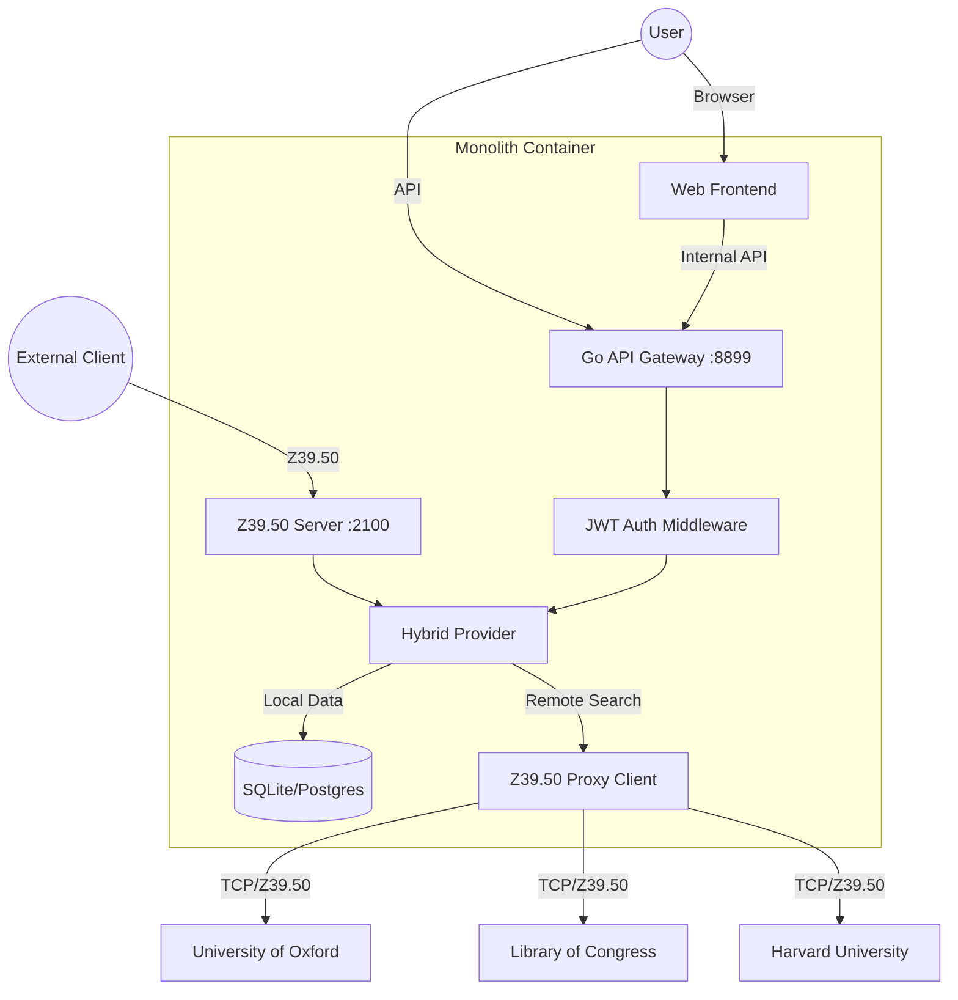

# Open-Z3950-Gateway


-blue)


**Open-Z3950-Gateway** is a modern, full-stack Inter-Library Loan (ILL) and Z39.50 gateway platform. It bridges the gap between modern Web APIs and legacy library protocols.

It serves as both a **Z39.50 Client** (proxying requests to Oxford, Harvard, LOC) and a **Z39.50 Server** (exposing local data), wrapped in a beautiful React UI with multi-tenant authentication.

## 🌟 Key Features

*   **Hybrid Architecture**: Seamlessly searches local databases (SQLite/Postgres) OR proxies requests to remote Z39.50 servers.
*   **Advanced Query Builder**: Visual UI for building complex boolean queries (e.g., `Title=Linux AND (Author=Torvalds OR Subject=Kernel)`).
*   **Recursive RPN Engine**: Backend fully supports arbitrarily nested Z39.50 Type-1 queries with true boolean logic.
*   **Extended Attributes**: Support for comprehensive Bib-1 attributes:
    *   **Title** (4), **Author** (1003), **ISBN** (7), **ISSN** (8), **Subject** (21), **Date** (31), **Any** (1016).
*   **Multi-Syntax Support**: Automatically negotiates **MARC21**, **UNIMARC**, or **SUTRS** (Text) based on target capabilities.
*   **ILL Management**: Complete Inter-Library Loan workflow (Request -> Review -> Approve/Reject) with user tracking.
*   **SaaS Ready**:
    *   **JWT Authentication**: Secure login/registration system.
    *   **Dynamic Targets**: Admins can add/remove remote libraries via the Web UI (no restart needed).
    *   **Dockerized**: Single-container deployment (Go binary + Embedded Frontend).

## 🛠 Architecture



## 🚀 Quick Start

### Docker (Recommended)

Run the full stack with a single command.

```bash
docker compose up -d --build
```

Access the application at **http://localhost:8899**.

*   **Admin Account**: `admin` / `admin`
*   **User Account**: Register a new one via the UI.

### Manual Build

1.  **Build Frontend**:
    ```bash
    cd webapp
    npm install && npm run build
    cd ..
    ```
2.  **Prepare Assets**:
    ```bash
    mkdir -p pkg/ui
    cp -r webapp/dist pkg/ui/dist
    ```
3.  **Build Backend**:
    ```bash
    go build -o gateway ./cmd/gateway
    ```
4.  **Run**:
    ```bash
    export DB_PROVIDER=sqlite
    export DB_PATH=./library.db
    ./gateway
    ```

## 🔌 API Documentation

All API endpoints start with `/api`. Protected endpoints require `Authorization: Bearer <token>` or `X-API-Key`.

### Search API

**Endpoint**: `GET /api/search`

Supports recursive boolean logic.

| Parameter | Description | Example |
| :--- | :--- | :--- |
| `db` | Target Database Name | `Oxford`, `Local` |
| `term1` | First search term | `Go Language` |
| `attr1` | First attribute (Use ID) | `4` (Title) |
| `op2` | Operator for 2nd clause | `AND`, `OR`, `AND-NOT` |
| `term2` | Second search term | `2024` |
| `attr2` | Second attribute | `31` (Date) |
| `opN`... | Nth Operator | `OR` |

**Example URL**:
`/api/search?db=Local&term1=Go&attr1=4&op2=AND&term2=Pike&attr2=1003`
*(Title="Go" AND Author="Pike")*

### Supported Attributes (Bib-1)

| Name | ID | Description |
| :--- | :--- | :--- |
| **Personal Name** | 1 | Author name |
| **Title** | 4 | Book title |
| **ISBN** | 7 | International Standard Book Number |
| **ISSN** | 8 | International Standard Serial Number |
| **Subject** | 21 | Subject heading |
| **Date** | 31 | Date of publication |
| **Any** | 1016 | Keyword search (Title/Author/Subject) |

### Management API

| Method | Endpoint | Description |
| :--- | :--- | :--- |
| **POST** | `/api/auth/login` | Get JWT token |
| **GET** | `/api/scan` | Browse index (`?term=Hamlet&db=LCDB`) |
| **GET** | `/api/targets` | List available libraries |
| **POST** | `/api/ill-requests` | Submit a loan request |
| **GET** | `/api/admin/targets` | Manage Z39.50 targets (Admin only) |

## 📦 Project Structure

*   `cmd/gateway`: Main entry point (HTTP + ZServer).
*   `pkg/z3950`: Core protocol stack (BER encoding, RPN builder, Client).
*   `pkg/provider`: Data abstraction layer.
    *   `hybrid.go`: Routes requests between Local and Proxy.
    *   `proxy.go`: Handles remote Z39.50 connections.
    *   `sqlite.go` / `postgres.go`: Local persistence.
*   `pkg/auth`: JWT and Password hashing utilities.
*   `pkg/ui`: Embedded frontend assets.
*   `webapp`: React + Vite + TypeScript source code.

## 🤝 Contributing

See [CONTRIBUTING.md](CONTRIBUTING.md) for details on how to submit pull requests.

## License

MIT