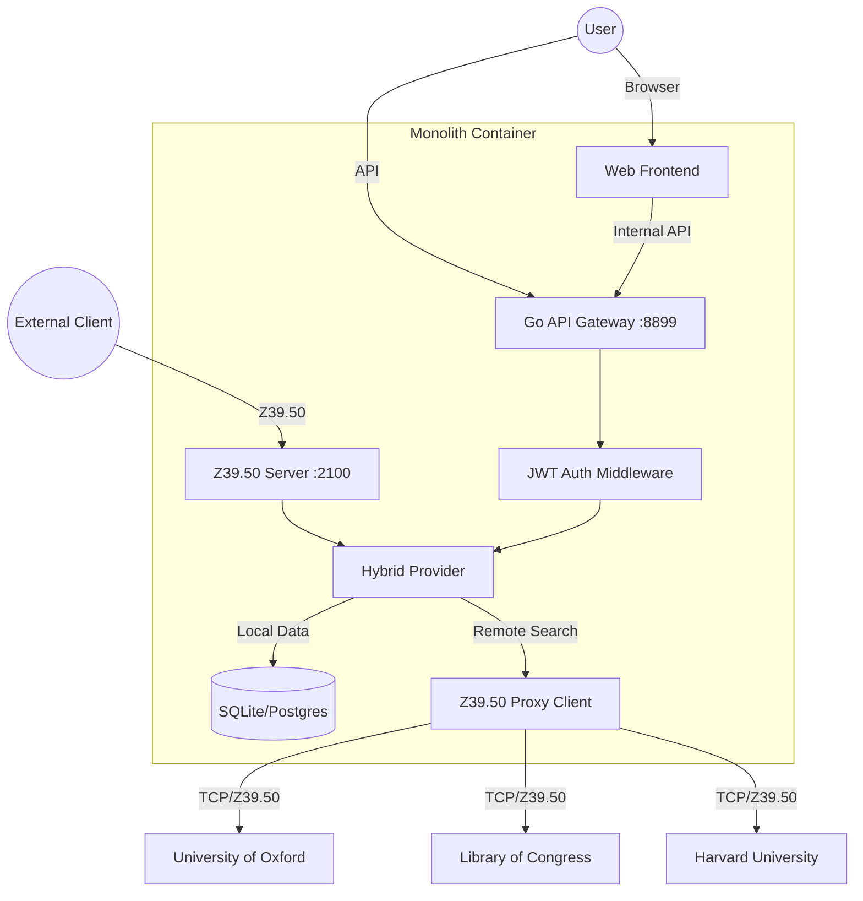

# Open-Z3950-Gateway


-blue)


**Open-Z3950-Gateway** is a modern, enterprise-grade Inter-Library Loan (ILL) and Z39.50 gateway platform. It bridges the gap between modern Web APIs and legacy library protocols, providing a beautiful, unified interface for searching and managing bibliographic data across the globe.

> **Why this exists:** Most library systems are locked behind ancient Z39.50 protocols and ugly desktop clients. This project modernizes the experience with a reactive Web UI, JSON APIs, and seamless proxying.

## ✨ Key Features

### 🔍 Powerful Search Engine
*   **Hybrid Search**: Simultaneously search your local database (SQLite/Postgres) and remote Z39.50 targets (Oxford, Harvard, Library of Congress).
*   **Recursive Boolean Queries**: Build complex queries like `(Title=Linux OR Title=Unix) AND (Author=Torvalds)`.
*   **Intelligent Decoding**: Automatically handles legacy character encodings (MARC-8, GBK, Big5, ANSEL) and converts them to UTF-8.

### 🌐 Modern Web Interface
*   **Responsive Design**: Built with React and Pico.css for a clean, mobile-friendly experience.
*   **Internationalization (I18n)**: Full support for **English** and **Chinese (简体中文)**.
*   **Search History**: Local-storage based history for quick query restoration.
*   **Citation Generation**: One-click export to **BibTeX** and **RIS** formats.

### 📚 Library Management
*   **Holdings Display**: Real-time availability status, call numbers, and shelf locations.
*   **ILL Workflow**: Integrated Request -> Review -> Approve/Reject workflow for inter-library loans.
*   **Dynamic Targets**: Admins can add/configure remote Z39.50 servers via the UI without restarting.

## 🛠 Architecture



## 🚀 Quick Start

### Docker (Recommended)

Run the full stack with a single command. The image is optimized (Alpine-based, ~25MB).

```bash
docker compose up -d --build
```

Access the application at **http://localhost:8899**.

*   **Admin Account**: `admin` / `admin`
*   **User Account**: Register a new one via the UI.

### Manual Build

1.  **Build Frontend**:
    ```bash
    cd webapp
    npm install && npm run build
    cd ..
    ```
2.  **Prepare Assets**:
    ```bash
    mkdir -p pkg/ui
    cp -r webapp/dist pkg/ui/dist
    ```
3.  **Build Backend**:
    ```bash
    # Requires Go 1.24+
    go build -o gateway ./cmd/gateway
    ```
4.  **Run**:
    ```bash
    export DB_PROVIDER=sqlite
    export DB_PATH=./library.db
    ./gateway
    ```

## ⚙️ Configuration

The application is configured via environment variables.

| Variable | Description | Default |
| :--- | :--- | :--- |
| `DB_PROVIDER` | Database backend: `sqlite` or `postgres` | `sqlite` |
| `DB_PATH` | Path to SQLite database file | `./library.db` |
| `DB_DSN` | Postgres connection string | - |
| `JWT_SECRET` | Secret key for signing JWT tokens | (Hardcoded dev secret) |
| `PORT` | HTTP Server Port | `8899` |
| `ZSERVER_PORT` | Z39.50 Server Port | `2100` |
| `GATEWAY_API_KEY`| API Key for protected non-user endpoints | - |

## 📖 Documentation

*   [**Protocol Details**](docs/PROTOCOL.md): Technical specs of the Z39.50 implementation (PDUs, OIDs).
*   [**Maintenance Tools**](docs/TOOLS.md): CLI utilities for database inspection and connection debugging.
*   [**Frontend Guide**](webapp/README.md): Development guide for the React application.

## 🤝 Contributing

We welcome contributions! Please see [CONTRIBUTING.md](CONTRIBUTING.md) for details.

1.  Fork the repo.
2.  Create your feature branch (`git checkout -b feat/amazing-feature`).
3.  Commit your changes (`git commit -m 'feat: add amazing feature'`).
4.  Push to the branch (`git push origin feat/amazing-feature`).
5.  Open a Pull Request.

## License

MIT © 2026 Open-Z3950-Gateway Contributors
